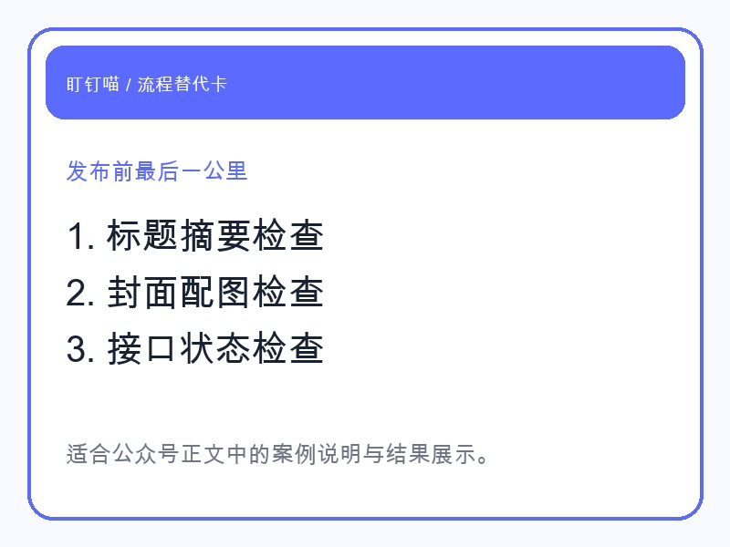
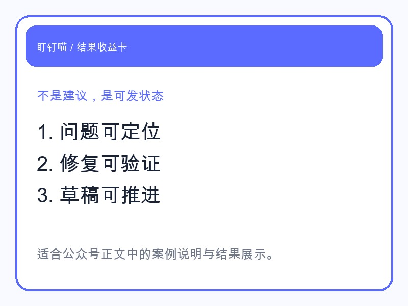

## 很多内容不是写不出来，而是发不出去

做公众号的人都懂。

一篇稿子写完，并不等于可以发。

标题有没有超长。

摘要有没有写。

封面是不是就绪。

文内图片路径对不对。

转出来的 HTML 有没有问题。

接口、密钥、白名单是不是正常。

这些事每一项都不复杂，但足够把一篇原本已经完成的内容继续拖住。

## 所以我专门测了龙虾的“最后一公里”

这次我让龙虾不只是写稿，而是继续往下做一件更像运营管家的事：

**把发布前复检整套跑完。**

它实际做的动作包括：

- 校验标题、摘要和字数
- 检查封面和配图文件是否存在
- 渲染 HTML
- 跑 dry-run，看接口链路是否正常
- 如果接口报错，再继续定位是白名单、密钥还是别的问题

这一步的价值，不在于它“会检查”。

而在于它能把那些原本需要你自己逐条确认的问题，先替你排一遍。

## 最后我真正想看到的，是“现在能不能发”

龙虾给我的不是一串空泛建议。

而是一个很明确的结果：

- 哪些检查通过了
- 哪些地方还卡住
- 卡住的具体原因是什么
- 修完之后能不能真的进草稿箱，能不能真的正式发布

这就把运营者最烦的最后一步，变成了一个有结果、有状态的流程。

## 为什么这种展示更适合拿来引流

因为用户不关心你背后有多少提示词。

他们只关心一件事：

**这个龙虾到底能不能替我把活干掉。**

你把“发布前复检”这个过程展示出来，反而最容易让人理解产品价值。

因为这就是最具体的工作场景。

## 最后

如果你现在也在做公众号，应该会知道：

真正拖住你的，经常不是写稿，而是最后这堆零碎确认。

龙虾的价值，就是把这些零碎确认变成一套能跑通的工作过程。

你看到的，不再是“一个会说话的 AI”。

而是一个会替你把公众号发出去的龙虾。
