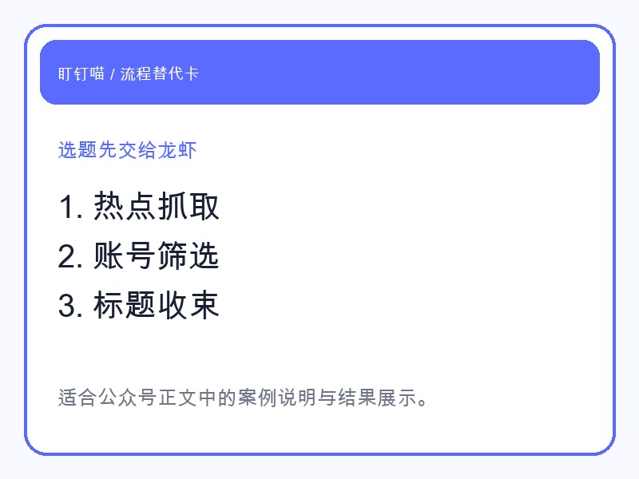
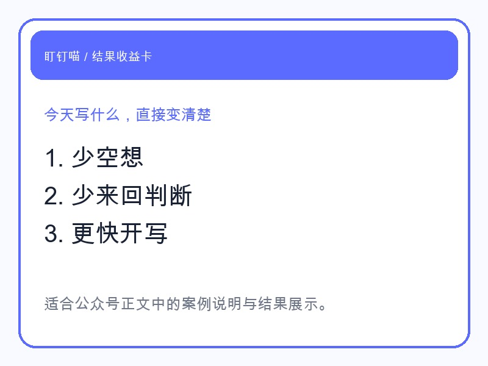

## 先说结论

如果你自己做公众号，你一定知道，最拖人的不是写，而是**决定今天写什么**。

我这次让龙虾直接接手这一步，不是让它给我“灵感”，而是看它能不能把选题从模糊想法推进成**可以直接开写的方向**。

结果很直接：它先抓热点，再结合账号定位筛掉不适合的题，最后给出能写、能发、能引流的标题方向。

这一步如果人自己做，通常会消耗一整个上午。

## 龙虾到底替我做了什么

它不是一句“最近这个热点不错”就结束。

它接手的是整条前置链路：

- 拉当天热点，先看哪些话题真的在讨论
- 对照账号定位，筛掉和“盯钉喵”无关的话题
- 再把剩下的热点改写成**适合引流的公众号角度**
- 最后落成可以直接开始写的标题和摘要

也就是说，龙虾不是在“陪你头脑风暴”。

它是在做一件更有结果感的事：**把今天该写什么，往前推进到你可以直接开工。**

## 我更在意的是它给出的结果长什么样

这次我真正想看的，不是它会不会说，而是它最后交付的东西够不够落地。

我看到的结果包括：

- 当天可跟的热点方向
- 哪个热点适合这个账号，哪个不适合
- 适合引流的切入角度
- 可直接开写的标题草案

这对一人公司特别重要。

因为你最缺的不是“多一个建议”，而是少一点反复判断。

当你不再自己来回想“到底写哪个”，内容节奏才会开始稳定。

## 这种能力最适合谁

如果你也在做公众号，尤其是下面这几类人，会很有体感：

- 自己就是内容团队的人
- 有产品要宣传，但内容节奏总断
- 明明有很多想法，却卡在“今天写什么”
- 想持续发，但不想每天从空白页开始

你真正需要的，不是一个“很会写”的工具。

你需要的是一个能把**选题前这堆判断活**先接过去的龙虾。

## 最后

这篇不是想讲选题理论。

只想把一个结果展示给你看：

**龙虾可以先替你把“写什么”这件事做成结果。**

如果你愿意，后面甚至可以接着让它把写稿、配图、复检、发草稿箱一起跑完。
