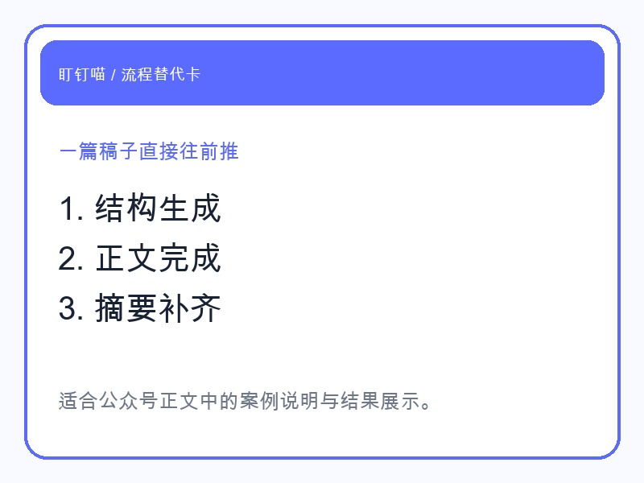
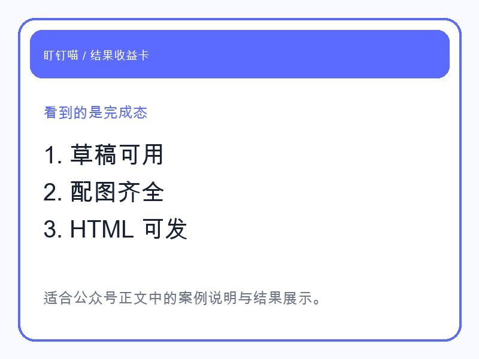

## 我测试的不是“会不会写”，而是“能不能做完”

现在很多人对 AI 写稿已经不陌生了。

但真正落到公众号运营里，问题从来不是“它能不能写一段话”，而是：**它能不能把一篇稿子从空白做到可发。**

所以这次我没有只让龙虾生成一段正文。

我让它接手一整篇公众号文章，看它能不能把结构、正文、摘要、配图和排版一路接起来。

## 它接手的，不只是正文

龙虾真正做的事，是把写稿拆成几步，然后逐步交付：

- 先根据方向收束标题
- 再按账号定位写正文结构
- 顺手补上摘要和发布信息
- 生成封面和案例卡片
- 最后转成公众号可用的 HTML

这跟“吐一段 AI 文案”完全不是一回事。

因为对运营者来说，最痛苦的往往不是正文，而是正文前后那些必须自己补的工作。

## 我看到的结果更像一个完成态，而不是半成品

这次让我最有感觉的，是它输出的不再只是一个 `.md` 文件。

而是一套可继续往下走的交付：

- 一篇完整草稿
- 一个能直接用的摘要
- 一张封面
- 几张文内案例卡
- 一份已经转好的 HTML

对一人公司来说，这个差别非常大。

半成品会一直拖着你。

完成态才会真正减少你的手工。

## 这类龙虾最适合拿来做什么

如果你想用龙虾做内容，不一定是要它“写得多有文采”。

更实际的用法是：

- 先帮你把初稿做出来
- 再把发布前要补的材料补齐
- 让你只负责最后的判断和微调

这样你看到的不是一个“帮你续写”的工具，而是一个**真的能接活的公众号搭子**。

## 最后

很多工具只能给你一段内容。

龙虾更有价值的地方，是它可以把**写稿过程本身**做成结果。

这才是运营里真正省时间的地方。
