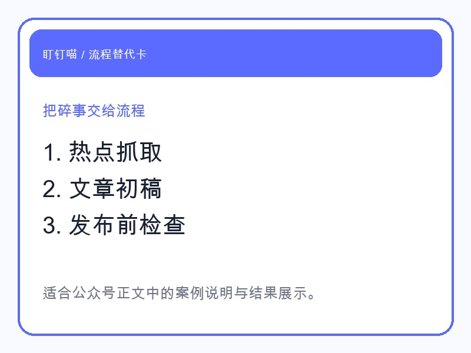
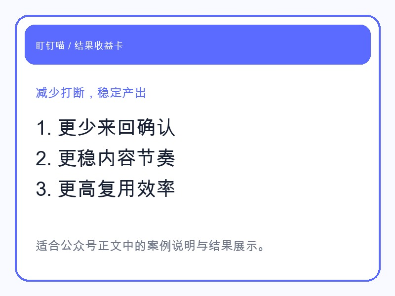
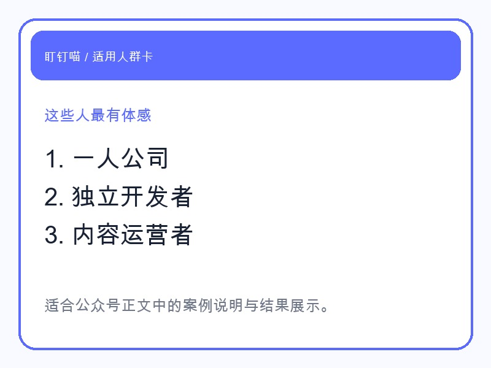

## 热点为什么会火，不在功能本身

今天，**“微信新功能被称为社恐福音”** 这个话题刷了起来。

很多人表面上在讨论一个新功能，真正被戳中的，其实是另一层情绪：大家不是不愿意沟通，而是越来越不想把精力花在那些低价值、重复、打断式的沟通上。

被突然拉进来的消息。

来回确认很多轮却没有结果的对话。

明明一句话说不清，却又必须盯着手机等回应的时刻。

这类消耗，放在工作里更明显。尤其是一人公司、独立开发者、内容创业者，表面看起来只是“回几条消息”，实际上被打碎的是一整天的专注力。

所以这个热点会火，不只是因为“社恐”两个字有传播力，而是因为越来越多人已经意识到：**真正让人累的，不是交流本身，而是交流背后的手工流程。**

## 一人公司最怕的，从来不是忙，而是一直被打断

一个人做业务，最难的不是某一件大事。

最难的是那些看起来都不大、但会持续把你拽出工作状态的小事。

比如你刚准备写一篇内容，结果要先找选题。

选题定了，又要找参考。

写到一半，突然有人来问进度、问价格、问安排。

你回完消息，思路断了。

好不容易把稿子补上，又要想标题、做封面、配图、转格式、检查发布材料。

每一项都不难，但每一项都要你亲手碰一下。最后的结果不是“工作很多”，而是**整个注意力被拆得很碎**。

很多人以为自己缺的是效率工具。

但更准确一点说，大家缺的是一个能把这些碎事接过去、让自己重新回到核心工作的搭子。

## 盯钉喵接手的，不只是动作，更是整条链路里的来回消耗

这也是为什么我越来越觉得，盯钉喵这种智能搭子的价值，不在于“会不会聊天”，而在于**能不能把原本需要你亲自来回处理的动作，变成一条稳定跑通的流程**。

拿公众号这件事来说，很多人卡住，不是不会写，而是写之前和写之后的杂事太多。

热点要不要跟？

这篇应该从什么角度切？

标题怎么更像传播内容，而不是产品说明？

正文写完后，封面、配图、排版、发布检查怎么接上？

如果每次都靠人从零开始拼，内容就很难稳定。

盯钉喵更适合做的，是把这条链路接起来：

- 先抓当天热点，判断有没有值得借势的切口
- 再把角度收束成适合账号定位的宣传叙事
- 接着生成文章初稿、封面和案例卡片
- 最后把排版、发布前检查和 dry-run 一起补齐

这时候你保留的，不是所有手工动作，而是最重要的判断：这篇要不要发、要发给谁看、要突出哪一个结果。

换句话说，盯钉喵不是替你“想一个点子”就结束了。

它更像一个真正能干活的内容搭子，把你从反复确认、反复整理、反复补漏里解放出来。

## 真正的收益，不是省出半小时，而是开始稳定地产出

很多人低估了这件事。

他们会把自动化理解成“帮我快一点”。

但对一人公司来说，更重要的收益通常不是快，而是稳。

你不再因为临时消息把一篇内容拖三天。

你不再因为最后差封面和排版，稿子一直发不出去。

你不再每次都从空白页开始，靠意志力把一套流程重新拼一遍。

真正的变化通常体现在三个地方：

- **中断变少了**：不用总在“写作、找资料、回消息、补物料”之间来回跳
- **输出稳定了**：一篇内容不再只停留在草稿，而是能走到可发布状态
- **复用开始出现**：标题习惯、配图习惯、发布检查开始变成可重复的方法

当一条链路稳定以后，人的精力才有机会留给更值钱的部分：判断、取舍、表达、成交。

## 适合盯钉喵的人，不是“大公司团队”，而是已经被琐事拖住的人

如果你本来就有完整团队，每个环节都有人接手，那智能搭子的价值会被稀释。

但如果你属于下面这几类人，体感会非常明显：

- 自己就是内容团队的一人公司
- 既要做产品，又要做传播的独立开发者
- 需要持续发内容、跟进客户、维护节奏的小团队负责人
- 明明业务有方向，却总被执行碎事拖住的人

这类人最需要的，不是再听一遍“要提高效率”。

而是尽快把那些会反复出现、但又不值得自己亲手做完的动作，交给一个可靠的搭子。

## 最后

“社恐福音”这个热点真正提醒我们的，不是大家不想说话了。

而是大家越来越想把**无效打扰、低效来回和重复手工**从每天的工作里拿掉。

这也是盯钉喵真正想解决的问题。

不是替你做梦。

是替你把那些本来就该流程化的部分，真的接过去。

如果你最近也明显感觉到：自己不是没能力，而是总被零碎流程拖住，那你可以开始试试，先把其中一条链路交给盯钉喵。

当它开始帮你把事情做完，而不只是陪你聊两句，你会很快感受到差别。
